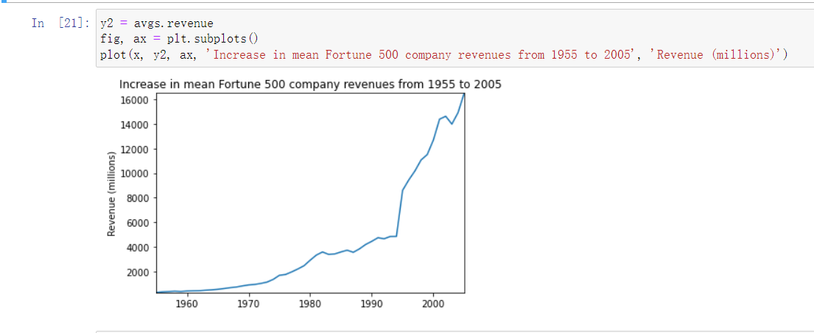

# 这是一个选择排序测试


# 这是一个数据分析

首先，没安装库的先安装库，依次执行：
pip install matplotlib
pip install pandas
pip install seaborn
或：
pip3 install matplolib
pip3 install pandas
pip3 install seaborn

pip适配版本为py2 pip3适配版本为py3


```python
%matplotlib inline
import pandas as pd
import matplotlib.pyplot as plt
import seaborn as sns
```

加载数据集


```python
df = pd.read_csv('fortune500.csv')
```

## 数据表

这是一个表头


这是一个表尾


对数据属性列重命名


```python
df.columns = ['year', 'rank', 'company', 'revenue', 'profit'] 
```

检查数据条目总数


```python
Input: len(df)
```


    Output: 25500


查看各列属性的数据格式


```python
Input: df.dtypes
```


    Output: 
    year         int64
    rank         int64
    company     object
    revenue    float64
    profit      object
    dtype: object


检查表中非数值类型的profit


```python
Input:
non_numberic_profits = df.profit.str.contains('[^0-9.-]')
df.loc[non_numberic_profits].head()
```


统计非数值的profit条目数


```python
Input: len(df.profit[non_numberic_profits]) 
```


    Output: 369


使用直方图查看
    


删除这些条目


```python
Input: 
df = df.loc[~non_numberic_profits]
df.profit = df.profit.apply(pd.to_numeric)
```

再次统计条目总数


```python
Input: len(df)
```


    Output: 25131

查看各列属性的数据格式


## 使用matplotlib绘图

定义变量和方法


```python
group_by_year = df.loc[:, ['year', 'revenue', 'profit']].groupby('year')
avgs = group_by_year.mean()
x = avgs.index
y1 = avgs.profit
def plot(x, y, ax, title, y_label):
    ax.set_title(title)
    ax.set_ylabel(y_label)
    ax.plot(x, y)
    ax.margins(x=0, y=0)
```

绘图

    


绘制收入曲线



    


对结果进行标准差处理 


    


